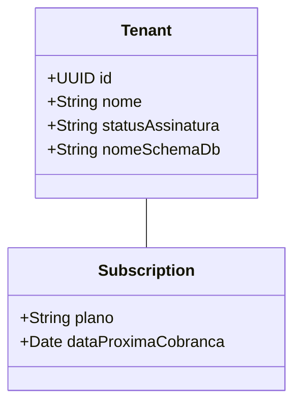

# Chrona: Análise do Projeto e Plano Estratégico

## 1. Contexto e Análise de Nicho
**Estado Atual:** O Chrona é um sistema clássico de **Rastreamento de Tempo e Gestão de Projetos**. Ele permite registrar horas (`TimeEntry`) em Projetos (`Project`) e Tarefas (`Task`) para Clientes (`Client`) específicos.

### Nicho: Escritórios de Arquitetura
**Veredito:** **Encaixe Excelente.**
Escritórios de arquitetura operam fortemente baseados em horas faturáveis ou taxas fixas por etapa. Eles sofrem cronicamente com "aumento de escopo" (scope creep) e horas não cobradas.

**Por que se encaixa:**
- **Foco no Projeto:** Tudo na arquitetura gira em torno do "Projeto".
- **Conformidade:** Eles precisam de registros rigorosos de quem trabalhou em qual desenho/fase para fins legais e de cobrança (RRT).

**Lacunas a Preencher (As "Funcionalidades Matadoras" para Arquitetos):**
1.  **Etapas (Phases):** Arquitetos não têm apenas "Tarefas"; eles têm etapas padrão (Estudo Preliminar, Anteprojeto, Executivo, Acompanhamento de Obra). Você deve estruturar a `Task` ou adicionar uma entidade `Phase` para refletir esse padrão (ex: tabela CAU/IAB).
2.  **Despesas Reembolsáveis (Expenses):** Plotagem, viagens, taxas de aprovação. Arquitetos precisam cobrar isso de volta do cliente. *O sistema atual não possui uma entidade `Expense`.*
3.  **Controle de Budget/Retainer:** "Cobramos R$ 50k por esta etapa, já queimamos R$ 30k em horas." Visualizar essa taxa de queima (burn rate) é ouro para eles.

## 2. Melhorias

### Técnicas
- **Pipeline CI/CD:** Automatizar o processo de build e teste (GitHub Actions) para evitar problemas de "funciona na minha máquina".
- **Testes:** Aumentar a cobertura de testes unitários, especialmente para a lógica de "Cálculo de Faturamento".
- **Docker Compose:** Criar um `docker-compose.yml` que sobe Backend, Frontend e Postgres instantaneamente para qualquer novo desenvolvedor.

### Funcionais
- **Faturamento (Invoicing):** Gerar faturas em PDF baseadas nos Time Entries.
- **Portal do Cliente:** Permitir que o *Cliente do Escritório de Arquitetura* faça login e veja o status do projeto (apenas leitura).
- **Integrações:**
    - **Calendário:** Sincronizar `TimeEntry` com Google/Outlook Calendar.
    - **Financeiro:** Exportar para Quickbooks/ContaAzul/Omie.

## 3. Estratégia de Escala: O Dilema do Banco de Dados
Você perguntou: *"Cada cliente vai ter seu banco de dados?"*

### Opção A: Banco Único Gigante (Coluna Discriminadora)
*Todos os dados em uma tabela com uma coluna `tenant_id`.*
- **Prós:** Mais barato, mais fácil de gerenciar, fácil de rodar análises cruzadas (para você).
- **Contras:** Risco de vazamento de dados (um bug mostra dados do Cliente A para o Cliente B), mais difícil fazer backup/restore de apenas um cliente.

### Opção B: Banco-por-Tenant (Bancos Separados)
*Separação física.*
- **Prós:** Segurança máxima, fácil restaurar um cliente específico.
- **Contras:** Caro (recursos), difícil manter migrações (rodar SQL em 1000 bancos).

### Opção C: Schema-por-Tenant (Recomendado)
*Um Banco de Dados, mas **Schemas** (pastas) separados para cada cliente.*
- **Prós:** Bom equilíbrio. Dados isolados logicamente (segurança), mas compartilham recursos (custo).
- **Veredito:** **Vá de Schema-por-Tenant.** É o padrão para SaaS B2B. Mantém os dados do "Escritório A" completamente invisíveis para o "Escritório B".

## 4. Backoffice (O "Super Admin")
Para administrar seu SaaS, você precisa de um painel "Modo Deus" separado.

### Funcionalidades Principais
1.  **Gestão de Tenants:**
    - Criar novo "Escritório" (Tenant).
    - Suspender/Ativar acesso (se não pagarem).
2.  **Assinatura/Cobrança:**
    - Rastrear em qual plano estão (Free, Pro, Enterprise).
    - Status da integração Stripe/Asaas.
3.  **Analytics Global:**
    - "Quantos usuários ativos hoje?"
    - "Total de horas registradas em todo o sistema?"
4.  **Impersonation (Logar Como):**
    - Capacidade do suporte (você) "Logar como Usuário X" para debugar um problema sem pedir a senha deles.

### Rascunho do Modelo de Dados para Backoffice

